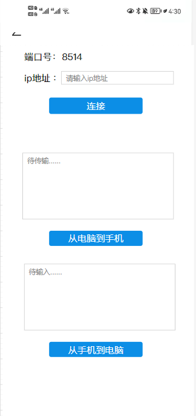
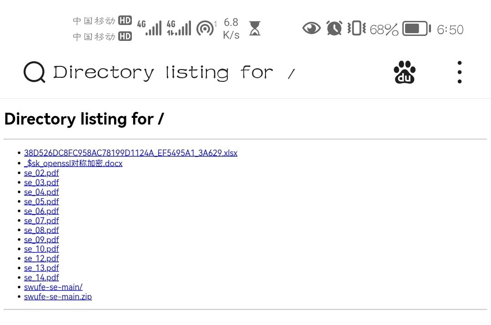
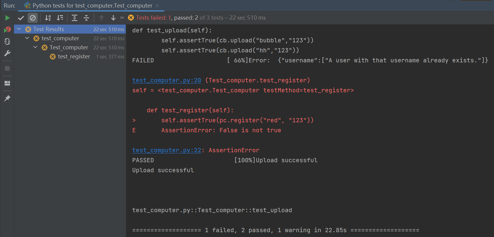
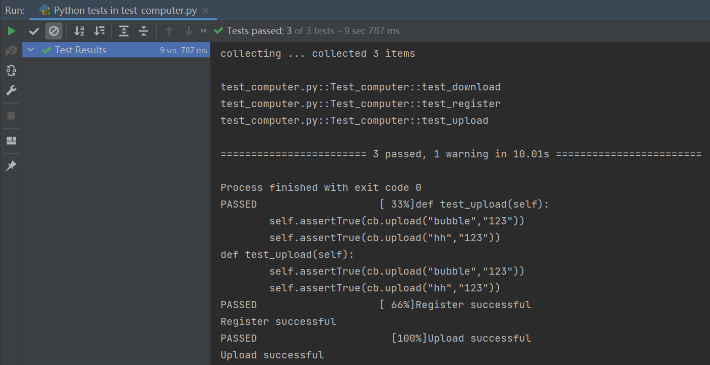
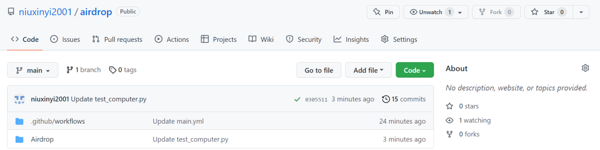

## 
airdrop软件介绍

41911166董文佳 41911138     牛新一

### **关键功能**

当电脑和手机处于同一局域网时，本软件可以实现如下三个功能：

1. 手机端可以在浏览器网页上下载电脑端的文件。
2. 手机端复制文字，可以在电脑端粘贴
3. 电脑端复制文字，可以在手机端粘贴
### **软件使用**

**软件使用前提：**
1. 手机端与电脑端处于同一局域网下。
2. 使用者拥有该软件的一个账号。

**软件的注册方法：**

本软件账号注册的方法十分简单，用户只需要输入新帐号的用户名与用户密码，点击注册，即可注册一个新的账号。注册过程中不需要通过邮箱、短信等方式发送验证码进行验证，只要新账号的用户名未被其他人使用，即可注册成功。

**电脑端发送文件，手机端下载文件功能的使用方法：**

第一步，用户需要输入正确的用户名和密码登录到如下界面：
 
第二步，用户需要输入电脑与手机所在局域网的ip地址，点击连接按钮，跳转到浏览器的下载网页，网页如下：
 
第三步，用户点击想要下载的文件，即可完成下载。

**电脑端复制手机端粘贴功能的使用方法：**

第一步，用户需要输入电脑与手机所在局域网的ip地址。

第二步，用户需要在电脑端将内容复制到剪切板。

第三步，点击“从电脑到手机”按钮，电脑端复制的内容即可出现在按钮上方的文本框内。

**手机端复制电脑端粘贴功能的使用方法：**

第一步，用户需要输入电脑与手机所在局域网的ip地址。

第二步，用户需要在手机端将内容复制到“从手机到电脑”按钮上方的输入框。

第三步，点击“从手机到电脑”按钮，手机端复制的内容即可出现电脑端的剪切板内。

### **关键代码**

我们将手机和电脑作为不同的客户端，使用了一个第三方服务器作为云Clipboard，部署在公网上（https://cloudcb.herokuapp.com/），并且加入了token的验证，支持多个用户使用，各个用户通过用户名加以区分。

**手机端用户登陆函数**

    def login(self, button):
        token = "%s:%s" % (self.username_w.text, self.password_w.text)
        token = base64.b64encode(token.encode('utf-8')).decode('utf-8')
        login_res = UrlRequest(
            "%sverify-user/" % SERVER_URI,
            req_headers = {'Authorization': "Basic %s" % token},
            on_success = self.store_data(token),
            on_error = utils.show_error,
            on_failure = self.show_failure
        )

在第三方网站用户数据库中查找登录的用户名和密码，若找到即可登陆成功。

**手机端上传函数**

    def upload(self, *args):
        payload = urllib.urlencode({'text': self.old_text})  # python2
        self.header['Content-type'] = 'application/x-www-form-urlencoded'
        copy_res = UrlRequest(
            self.url,
            req_headers = self.header,
            req_body = payload,
            on_success = self.paste,
            on_error = utils.show_error,
            on_failure = self.show_failure
        )

这里使用了urllib.urlencode()函数，结合UrlRequest()方法，实现upload方法，将手机端的文字输出到第三方网站该用户的用户日志上。

**手机端下载函数**

    def download(self, *args):
        self.paste_res = UrlRequest(
            self.url,
            req_headers = self.header,
            on_success = self.paste,
            on_error = utils.show_error,
            on_failure = self.show_failure
        )

这里直接使用UrlRequest()函数获取第三方网站上的用户日志的内容。

**电脑端上传函数**

    def upload(username, password):
        payload = {"text": copy(), "device": ""}
        res = requests.post(
            server_url+"copy-paste/",
            data = payload,
            auth = (username, password)
        )
        if res.status_code == 200:
            print("Succeses! Copied to Cloud-Clipboard.")
        else:
            print("Error: ", res.text)
            return False
        return True

直接获取剪切板的内容，将得到的文字与用户信息使用post()方法上传到第三方网站上。

**电脑端下载函数**

    def download(username, password):
        res = requests.get(server_url+"copy-paste/", auth=(username, password))
        if res.status_code == 200:
            paste(json.loads(res.text)["text"])
        else:
            print("Cannot download the data.")
            return False
        return True

通过用户名与密码在网站上找到对应的数据使用get()方法获取，并且更新到本地的clipboard.

### **单元测试**

功能一的核心是获得服务器的ip，代码量相对较少，因此没有对获得ip这一功能一中的关键代码进行测试。使用Python标准库中自带的unittest，对功能二复制粘贴的电脑端进行测试。测试主要分为三部分：电脑端是否能够把复制的文本上传到server云服务器（test_upload函数），电脑端能否从云服务器上下载共享的clipboard中的内容，并更新自己的clipboard（test_download函数），电脑端能否成功注册（test_register函数）。测试使用自带的assertTrue函数，如果为 true，则运行 Success，反之报错Failure。测试完整代码如下：

    import sys
    sys.path.append("..")
    import unittest
    import computer as pc
    class Test_computer(unittest.TestCase):

        def test_upload(self):
            self.assertTrue(pc.upload("bubble","123"))
            self.assertTrue(pc.upload("hh","123"))

        def test_download(self):
            self.assertTrue(pc.download("bubble","123"))
            self.assertTrue(pc.download("hh","123"))

        def test_register(self):
            self.assertTrue(pc.register("sky", "123"))
            self.assertTrue(pc.register("cloud","123"))

    if __name__ == '__main__':
        unittest.main()

&emsp;&emsp;由于之前已经注册过red用户和pink用户，因此直接执行这段代码，无法通过所有测试，结果如下图所示：

&emsp;&emsp;将函数register里的参数设置为未注册过的用户，则程序运行显示通过所有单元测试，如下图所示：

### **持续集成**

使用GitHub自带的持续集成服务GitHub Action来测试我们代码的可部署性。GitHub Action 是持续集成 (Continuous integration，简称 CI) 服务，它提供了虚拟服务器环境，基于它可以进行构建、测试、打包、部署项目。在GitHub中新建一个workflows，通过脚本编写actions组合，使得上传的Airdrop文件能够通过测试，正常运行。

设置该程序运行的虚拟环境为windows系统，使用python3.8版本。在测试程序运行前，安装requirement.txt文件中的第三方库，使得程序能够正常调用第三方库中的方法而不报错。requirement.txt文件中的内容如下所示：

    requests==2.21.0
    pyperclip==1.6.2

构建workflows的核心命令如下图所示：

    name: GitHub Actions Demo
    on: [push]
    jobs:
      Explore-GitHub-Actions:
        runs-on: ubuntu-latest
        steps:
          - run: echo "🎉 The job was automatically triggered by a ${{ github.event_name }} event."
          - run: echo "🐧 This job is now running on a ${{ runner.os }} server hosted by GitHub!"
          - run: echo "🔎 The name of your branch is ${{ github.ref }} and your repository is ${{ github.repository }}."
          - name: Check out repository code
            uses: actions/checkout@v3
          - run: echo "💡 The ${{ github.repository }} repository has been cloned to the runner."
          - run: echo "🖥️ The workflow is now ready to test your code on the runner."
          - name: List files in the repository
            run: |
          ls ${{ github.workspace }}
          - run: echo "🍏 This job's status is ${{ job.status }}."
 
    Python-Test:
      runs-on: windows-latest
      steps:
        - name: Check out repository code
          uses: actions/checkout@v3
        - name: Set up Python 3.8
          uses: actions/setup-python@v1
          with:
          python-version: 3.8
        - name: Install dependencies
          run: cd ${{ github.workspace }}/Airdrop && pip install  -r ./requirements.txt
        - name: Test   with Python
          run: cd ${{ github.workspace }}/Airdrop && python ./test_computer.py
&emsp;&emsp;设置好workflows，GitHub自动对上传的Airdrop代码进行了测试。在持续集成中，我们的代码通过了测试，测试成功结果如下图所示：

### **软件亮点**

**1.软件界面设计简洁，基础功能完备**

我们的Android软件设计简单明了，用户可以迅速掌握手机端和电脑端复制粘贴共享剪切板的操作方法。在文件传输功能中，软件自动帮助用户打开服务器提供的网址，无需用户进行额外的搜索网址操作。

**2.额外实现了电脑复制，手机粘贴功能**

除了实现文件传输和手机端复制，电脑端粘贴的功能。基于共享剪粘板的原理，我们还额外实现了电脑端复制，手机端粘贴的功能，使手机与电脑之间互相交互的功能更加完备。

