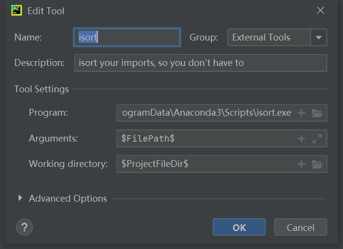
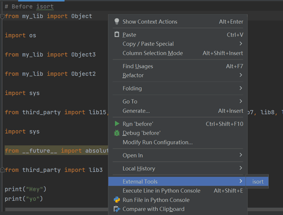
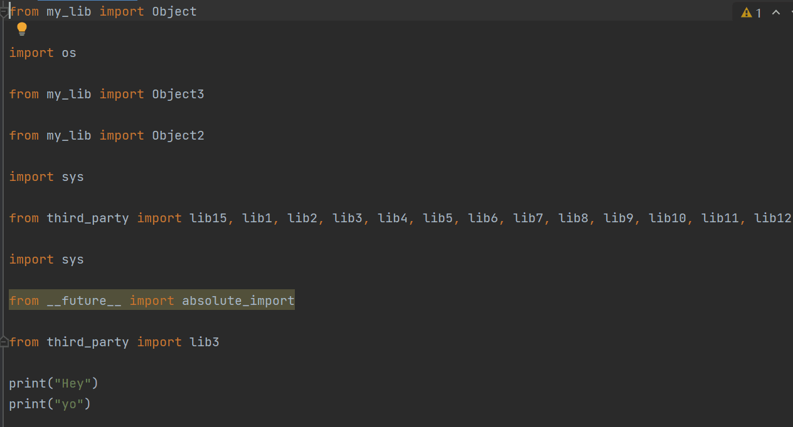
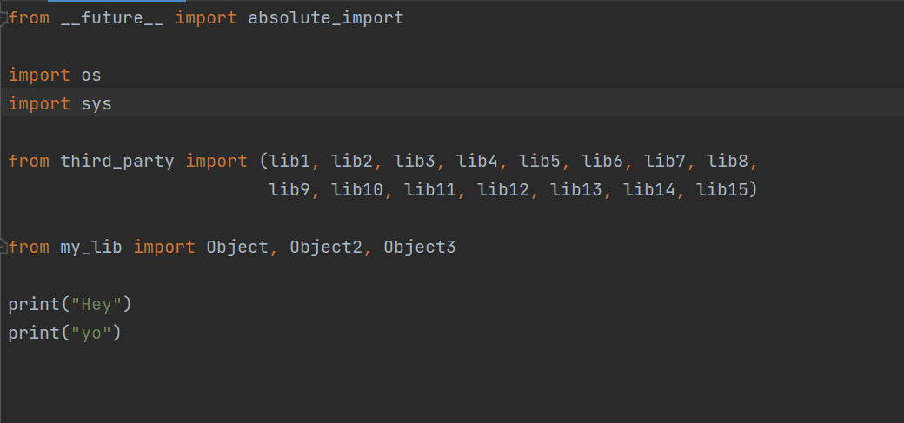

# Python使用isort包

## 1. isort包简介
&emsp;&emsp;isort包是一个用于调整python的import语句格式的工具包。isort可以将多个import按照一定的顺序排列、合并，使import部分更加工整和可读，也有利于多人协同工作时增加这一部分的可读性。
## 2. isort包的使用方法
### 2.1 在cmd中使用
```
isort XXX.py #修改文件的import顺序和格式
```
```
isort XXX.py --diff #只查看 isort 将做出的变更，但并不应用
```
### 2.2 在python中使用
```
import isort
isort.file("xxx.py")
```
### 2.3 在pycharm上使用
安装和使用步骤：
（1）在cmd中输入命令`where isort`，找到isort安装位置。
（2）在 PyCahrm 中打开File -> Settings -> Tools -> External Tools，设置isort工具如下图所示：

（3）在某个代码中找到已经配置好的isort工具，如下图所示：

## 3. isort包的使用效果
使用前：

使用后：


本文参考自[Python代码import语句整理格式化工具-isort简介及使用详解](https://juejin.cn/post/7026151419459665957#heading-4)